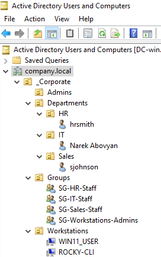
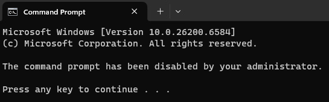
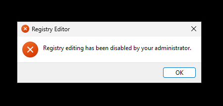
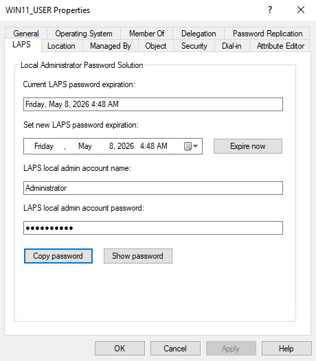
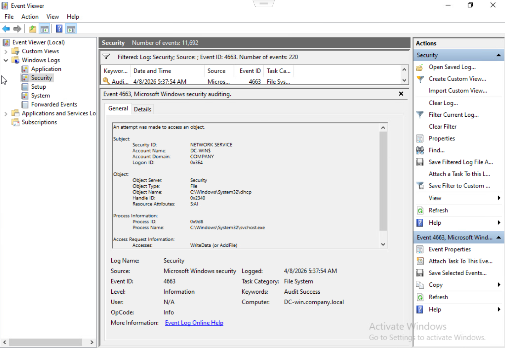
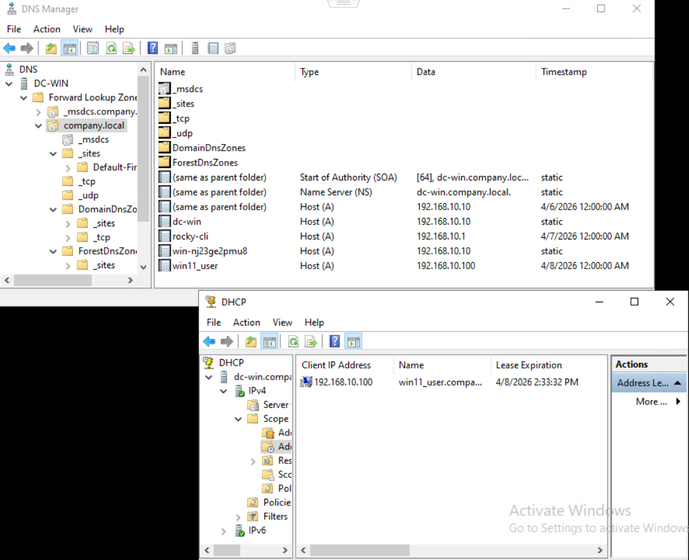

# Enterprise Identity & Security Home Lab
Deployment of a hybrid-OS enterprise environment featuring Windows Server 2022, Windows 11, and Rocky Linux integration.

## 🏗️ Architecture Overview
*   **Hypervisor:** VMware ESXi
*   **Domain Controller:** Windows Server 2022
*   **Client Workstation:** Windows 11 Pro
*   **Linux Integration:** Rocky Linux 9
*   **Network Services:** DNS, DHCP, Active Directory Domain Services (AD DS)

## 🚀 Key Features Demonstrated
### 1. Identity & Access Management (IAM)
*   **RBAC Implementation:** Designed a nested Organizational Unit (OU) structure for Departments (HR, IT, Sales) and implemented Role-Based Access Control using Security Groups.
*   **Hybrid-OS Integration:** Successfully joined a Rocky Linux VM to the Active Directory domain using `sssd` and `realmd`, allowing domain-wide SSH authentication and sudo-rights for AD Admins.

  

    
  

### 2. Automation & Governance (Group Policy)
*   **Endpoint Hardening:** Deployed GPOs to disable CMD/Registry access for standard users and enforced legal login banners.

  

    
    
  

  
*   **Drive Mapping:** Automated the deployment of departmental file shares (S: Drive) based on group membership.

  

### 3. Security Hardening
*   **Windows LAPS:** Implemented Local Administrator Password Solution (LAPS) to automatically generate unique local admin passwords.
  
  

    
  

*   **File Auditing:** Configured Advanced Audit Policies to track file deletions and modifications in sensitive corporate folders.
*
  

    
  

### 4. Infrastructure Services
*   **DHCP/DNS:** Configured a centralized DHCP scope on Windows Server with dedicated reservation ranges and DNS forward/reverse lookup zones.
  
  

    
  

## 🛠️ Challenges & Troubleshooting

### 1. Locked out of CMD on the Server
*   **Problem:** I created a "Lockdown GPO" to block the Command Prompt for users, but I accidentally applied it to the whole domain. This locked me out of CMD on the Server too!
*   **Fix:** I used PowerShell ISE (which wasn't blocked) to fix the registry. I then moved the GPO so it only affects standard users, not the Admins or the Server.

### 2. Linux Join Permissions
*   **Problem:** Rocky Linux wouldn't join the domain. It kept saying "Insufficient Permissions."
*   **Fix:** I discovered that Linux was trying to join the wrong folder. I changed the command to point specifically to the `Workstations` OU, and it joined immediately.

### 3. DNS Error in DHCP (0.0.0.0)
*   **Problem:** After turning on DHCP, the Windows 11 VM lost its connection. I checked `ipconfig` and saw the DNS was `0.0.0.0`.
*   **Fix:** I went to the DHCP settings on the Server and found that the DNS Scope Option was empty. I added the Server's IP address there, and the connection came back.

### 4. LAPS Password Not Showing
*   **Problem:** I set up LAPS, but the passwords were not appearing in Active Directory.
*   **Fix:** I learned that the computers needed "permission" to save their own passwords. I ran a PowerShell command to grant these permissions and enabled the local Admin account on Windows 11.

### 5. S: Drive (File Share) Not Appearing
*   **Problem:** The mapped network drive wasn't showing up for the HR or Sales users.
*   **Fix:** I updated the Group Policy setting from "Create" to "Replace" and made sure the GPO was linked to the Users' folder, not just the Computers' folder.

